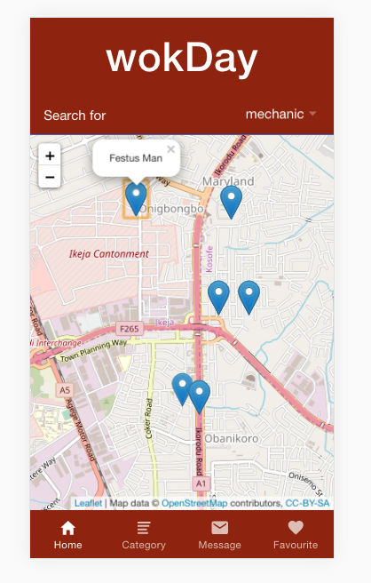

# WokDay

A play on the local vernacular to enquire for available, short-term/contract jobs, and the English description of the day of the week that isn't a weekend. Find work for your specific skill-set at a location near you. Find skilled workers around you in 2 taps of your screen.

 
 


## Getting Started

These instructions will get you a copy of the project up and running on your local machine for development and testing purposes.

### Prerequisites

Ensure that you have (at least) NPM vers. 6.12.1, Node vers. 12.13.1, Angular cli version 8.3.21, and Ionic cli version 5.4.13

```
npm version 6.12.1
Node version 12.13.1
angular cli 8.3.21
ionic cli 5.4.13
```

### Installing

Install leaflet (For map function)

```
npm install leaflet --save
```

Install capacitor (To access device geolocation functionality)

```
npm install --save @capacitor/core @capacitor/cli
```

Clone from the repo onto your machine

```
git clone https://github.com/occiandiaali/occians-wok-day.git
```

Run the node install command

```
npm install
```


## Built With

* [Ionic](https://ionicframework.com/) - The web framework used
* [Capacitor](https://capacitor.ionicframework.com/) - Native bridge for cross-platform web apps
* [Angular](https://angular.io/docs) - App framework
* [LEAFLET](https://leafletjs.com/) - Open-source JS library for mobile-friendly, interactive maps. 

## Authors

* **Occian Fumnanya Diaali** - *Initial work* - [qoboqo](https://qoboqo.ng)

See also the list of [contributors](https://github.com/your/project/contributors) who participated in this project.

## License

This project is licensed under the MIT License - see the [LICENSE.md](LICENSE.md) file for details

## Acknowledgments

* https://edupala.com/how-to-add-leaflet-map-in-ionic-4/